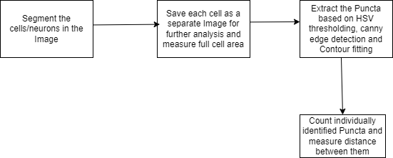

### Steps to get started
The CellSAM model requires `Python >=3.10`, so create a virtual environment with `Python>=3.10`.

- Clone the Repository
- Install dependencies using `pip install -r requirements.txt`
- To run analysis on Single Image, utilize `python pipeline.py --img-input-path="input_img_path" --cell-save-path="extracted_cell_save_path"`
- To run analysis on the folder, utilize `python run_on_folder.py --folder-input-path=" input folder path" --main-img-folder="top-level folder, where all the images are stored"` [if images are stored in C:/Users/name/inputs/cell_1/img_1.jpg, then main-img-folder will be "inputs", this is required to replicate folder structure in the output folder]

 

### Workflow:

### Controllable Parameters:

- `LOW_THRESHOLD and HIGH_THRESHOLD`: Color thresholding parameters, which will change according to imaging technique; defaults are for <b>fluorescence</b> imaging(neon color)
- `SMALL_MASK_THRESHOLD`: binary thresholding parameter, [general guidance: if the value in HSV space is on the lower side, utilize lower threshold - 30-45, if higher side go for 55-60]
